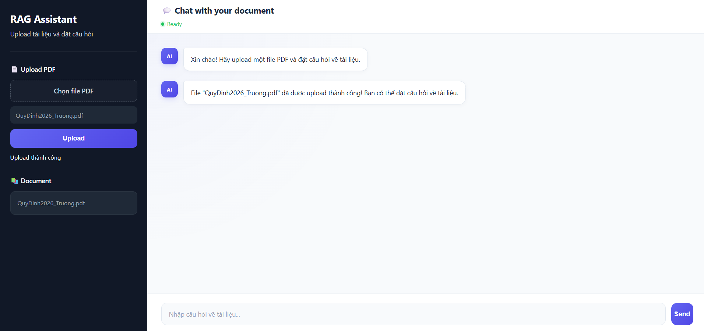
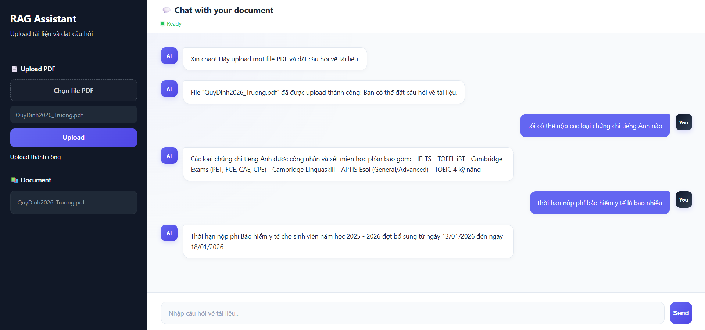

# 📄 PDF RAG Chatbot

A **production-style Retrieval-Augmented Generation (RAG) chatbot** that allows users to upload PDF documents and ask questions in natural language. The system retrieves the most relevant context from the document using semantic search and re-ranking, then generates precise, citation-backed answers via a local LLM — all running **100% offline** with no cloud API costs.

---

## ✨ Features

- 📤 **PDF Upload & Ingestion** — Upload any PDF; the system automatically extracts text, chunks it, embeds it, and stores it in a vector database.
- 🔍 **Semantic Retrieval** — Uses dense vector search (cosine similarity) to find the top-10 most relevant passages for a given question.
- 🏆 **Cross-Encoder Re-ranking** — Applies a `BAAI/bge-reranker-v2-m3` cross-encoder to re-rank the top-10 retrieved chunks and keep only the best 3, significantly improving answer quality.
- 🤖 **Local LLM Generation** — Generates answers using `Qwen2.5:3B` served locally via **Ollama** — no internet or paid API required.
- 📌 **Source Citations** — Every answer includes structured source metadata (document ID, page number, chunk index) so users can verify the information.
- 🖥️ **Web UI** — Comes with a clean browser-based chat interface served directly by the FastAPI backend.
- ⚡ **RESTful API** — Fully documented API endpoints for upload and chat, compatible with any HTTP client.

## 📸 Demo

**Upload a PDF**


**Ask Questions**



---

## 🏗️ Architecture

```
User Query
    │
    ▼
┌───────────────────────────────────────────────────────────┐
│                        RAG Pipeline                       │
│                                                           │
│  ┌──────────────┐    ┌─────────────────┐                  │
│  │ PDF Upload   │    │  Chat Request   │                  │
│  └──────┬───────┘    └────────┬────────┘                  │
│         │                     │                           │
│         ▼                     ▼                           │
│  ┌──────────────┐    ┌─────────────────┐                  │
│  │  PDFLoader   │    │EmbeddingService │                  │
│  │  (pypdf)     │    │ (BAAI/bge-m3)   │                  │
│  └──────┬───────┘    └────────┬────────┘                  │
│         ▼                     ▼                           │
│  ┌──────────────┐    ┌─────────────────┐                  │
│  │ChunkingService│   │ RetrievalService│                  │
│  │1000 / 200 ovlp│   │  (top-k=10)     │                  │
│  └──────┬───────┘    └────────┬────────┘                  │
│         ▼                     ▼                           │
│  ┌──────────────┐    ┌─────────────────┐                  │
│  │EmbeddingService│  │RerankingService │                  │
│  │ (BAAI/bge-m3)│   │(bge-reranker-v2)│                   │
│  └──────┬───────┘    └────────┬────────┘                  │
│         ▼                     ▼                           │
│  ┌──────────────┐    ┌─────────────────┐                  │
│  │  QdrantStore │    │ ContextService  │                  │
│  │(local on-disk)│   │  (top-k=3)      │                  │
│  └──────────────┘    └────────┬────────┘                  │
│                               ▼                           │
│                      ┌─────────────────┐                  │
│                      │  PromptService  │                  │
│                      └────────┬────────┘                  │
│                               ▼                           │
│                      ┌─────────────────┐                  │
│                      │   LLMService    │                  │
│                      │ (Qwen2.5:3b via │                  │
│                      │    Ollama)      │                  │
│                      └────────┬────────┘                  │
│                               ▼                           │
│                        Answer + Sources                   │
└───────────────────────────────────────────────────────────┘
```

---

## 🛠️ Tech Stack

| Layer | Technology |
|---|---|
| **Web Framework** | [FastAPI](https://fastapi.tiangolo.com/) + Uvicorn |
| **Embedding Model** | `BAAI/bge-m3` via [sentence-transformers](https://www.sbert.net/) (1024-dim) |
| **Re-ranking Model** | `BAAI/bge-reranker-v2-m3` (CrossEncoder) |
| **Vector Database** | [Qdrant](https://qdrant.tech/) (local on-disk mode) |
| **LLM** | `Qwen2.5:3B` via [Ollama](https://ollama.com/) |
| **PDF Parsing** | [pypdf](https://pypdf.readthedocs.io/) + [PyMuPDF](https://pymupdf.readthedocs.io/) |
| **Validation** | [Pydantic v2](https://docs.pydantic.dev/) + pydantic-settings |
| **Frontend** | Vanilla HTML + CSS + JavaScript |
| **Testing** | pytest (15 test files covering all service layers) |
| **Config** | python-dotenv (`.env` based) |

---

## 📁 Project Structure

```
pdf-rag-chatbot/
│
├── app/
│   ├── main.py                    # FastAPI app entry point
│   ├── dependencies.py            # Dependency injection factory
│   ├── pages.py                   # Page routes (Web UI)
│   │
│   ├── api/
│   │   ├── chat.py                # POST /api/chat endpoint
│   │   └── upload_pdf.py          # POST /api/upload_pdf endpoint
│   │
│   ├── core/
│   │   └── config.py              # App settings (pydantic-settings)
│   │
│   ├── loaders/
│   │   └── pdf_loader.py          # PDF page extraction (pypdf)
│   │
│   ├── services/
│   │   ├── ingestion_service.py   # PDF → chunks → embeddings → Qdrant
│   │   ├── chunking_service.py    # Sliding-window text chunker
│   │   ├── embedding_service.py   # BAAI/bge-m3 text embeddings
│   │   ├── retrieval_service.py   # ANN vector search
│   │   ├── reranking_service.py   # CrossEncoder re-ranking
│   │   ├── context_service.py     # Context + source building
│   │   ├── prompt_service.py      # Prompt template construction
│   │   ├── llm_service.py         # Ollama LLM generation
│   │   ├── rag_service.py         # RAG orchestration pipeline
│   │   └── citation_service.py    # Source citation builder
│   │
│   ├── vector_store/
│   │   └── qdrant_store.py        # Qdrant CRUD wrapper
│   │
│   ├── templates/
│   │   └── rag.html               # Chat Web UI
│   │
│   └── static/
│       ├── css/                   # Styles
│       └── js/                    # Frontend JS logic
│
├── data/
│   ├── uploads/                   # Saved uploaded PDF files
│   └── qdrant/                    # Qdrant local on-disk storage
│
├── tests/                         # 15 pytest test files
│   ├── test_chunking.py
│   ├── test_context.py
│   ├── test_embedding.py
│   ├── test_ingestion.py
│   ├── test_llm.py
│   ├── test_pdf.py
│   ├── test_pdf_loader.py
│   ├── test_pipeline.py
│   ├── test_prompt.py
│   ├── test_rag_pipeline.py
│   ├── test_reranking.py
│   ├── test_retrieval.py
│   ├── test_retrieval_2.py
│   └── test_vector_store.py
│
├── .env                           # Environment variables
├── .gitignore
├── requirements.txt
└── README.md
```

---

## 🚀 Getting Started

### Prerequisites

| Requirement | Version |
|---|---|
| Python | ≥ 3.10 |
| [Ollama](https://ollama.com/download) | Latest |
| Disk space | ~4 GB (models) |

### 1. Clone the repository

```bash
git clone https://github.com/khnguyen04/pdf-rag-chatbot.git
cd pdf-rag-chatbot
```

### 2. Create and activate virtual environment

```bash
python -m venv venv

# Windows
venv\Scripts\activate

# macOS / Linux
source venv/bin/activate
```

### 3. Install dependencies

```bash
pip install -r requirements.txt
```

### 4. Pull the LLM with Ollama

```bash
ollama pull qwen2.5:3b
```

> The embedding model (`BAAI/bge-m3`) and re-ranker (`BAAI/bge-reranker-v2-m3`) will be downloaded automatically from HuggingFace on first run.

### 5. Configure environment

```bash
# .env (already set, edit if needed)
APP_NAME=PDF RAG Chatbot
APP_VERSION=0.1.0
LLM_MODEL=qwen2.5:3b
VECTOR_SIZE=1024
COLLECTION_NAME=pdf_chunks
```

### 6. Run the application

```bash
uvicorn app.main:app --reload
```

The app will be available at:

- **Web UI:** `http://localhost:8000/rag`
- **API docs:** `http://localhost:8000/docs`

---

## 🔌 API Reference

### `POST /api/upload_pdf`

Upload and index a PDF document.

**Request:** `multipart/form-data`

| Field | Type | Description |
|---|---|---|
| `file` | File | PDF file to upload |

**Response:**

```json
{
  "message": "PDF uploaded and indexed successfully.",
  "filename": "document.pdf",
  "document_id": "document",
  "pages": 12,
  "chunks": 47
}
```

---

### `POST /api/chat`

Ask a question about an indexed document.

**Request:** `application/json`

```json
{
  "document_id": "document",
  "question": "What is the main topic of this paper?"
}
```

**Response:**

```json
{
  "answer": "The main topic is ...",
  "sources": [
    {
      "source_id": 1,
      "document_id": "document",
      "page": 3,
      "chunk_index": 7
    }
  ]
}
```

---

## ⚙️ How the RAG Pipeline Works

### 📥 Ingestion (on PDF upload)

1. **Load** — `PDFLoader` extracts text page-by-page using `pypdf`.
2. **Chunk** — `ChunkingService` applies a sliding-window strategy:
   - `chunk_size = 1000` characters
   - `chunk_overlap = 200` characters (to preserve context across boundaries)
3. **Embed** — `EmbeddingService` encodes each chunk with `BAAI/bge-m3` into a 1024-dimensional normalized vector.
4. **Store** — `QdrantStore` upserts all vectors into a local Qdrant collection named `pdf_chunks`, with metadata payload (document ID, page, chunk index, text).

### 💬 Chat (on user question)

1. **Embed query** — The user's question is encoded with `BAAI/bge-m3`.
2. **Retrieve** — `RetrievalService` performs ANN (Approximate Nearest Neighbor) cosine search filtered by `document_id`, retrieving **top-10** candidate chunks.
3. **Re-rank** — `RerankingService` runs all 10 query-chunk pairs through `BAAI/bge-reranker-v2-m3` (a CrossEncoder), then selects the **top-3** by re-rank score.
4. **Build context** — `ContextService` formats the top-3 chunks into a structured context string with `[SOURCE N]`, document name, and page number.
5. **Build prompt** — `PromptService` wraps the context and question in a strict instruction prompt that prevents hallucination.
6. **Generate** — `LLMService` calls `Qwen2.5:3B` via Ollama and returns the generated answer.
7. **Return** — The API returns the answer alongside a list of source citations.

---

## 🧪 Running Tests

```bash
pytest tests/ -v
```

Test coverage spans all service components:

| Test File | What It Tests |
|---|---|
| `test_chunking.py` | Sliding-window chunking logic |
| `test_embedding.py` | BGE-M3 embedding dimensions |
| `test_retrieval.py` | Vector similarity search |
| `test_reranking.py` | CrossEncoder re-ranking order |
| `test_context.py` | Context string and source building |
| `test_prompt.py` | Prompt template formatting |
| `test_llm.py` | Ollama LLM response generation |
| `test_ingestion.py` | End-to-end ingestion pipeline |
| `test_rag_pipeline.py` | Full RAG ask() pipeline |
| `test_vector_store.py` | Qdrant upsert and search |
| `test_pdf.py` / `test_pdf_loader.py` | PDF parsing |

---

## 🧠 Key Design Decisions

### Why Re-ranking?
Standard dense retrieval (bi-encoder) retrieves based on approximate similarity and can miss nuance. Adding a **CrossEncoder re-ranker** evaluates each query-chunk pair together, giving dramatically more accurate relevance scores at the cost of slightly higher latency — a standard production pattern for RAG systems.

### Why Qdrant local mode?
Qdrant supports an **on-disk persistence mode** without needing a separate server process, which makes the system easy to run locally without Docker or cloud infrastructure. The data is stored in `./data/qdrant/`.

### Why fully offline?
The entire stack — embedding, re-ranking, and LLM generation — runs locally. This makes the system cost-free to operate and suitable for privacy-sensitive documents.

### Service-oriented architecture
Each concern is isolated into its own service class (`EmbeddingService`, `RetrievalService`, `RerankingService`, etc.), injected via a factory function (`create_rag_service()`). This makes components independently testable and swappable (e.g., replacing Ollama with OpenAI requires changing only `LLMService`).

---

## 🔮 Possible Improvements

- [ ] **Streaming responses** — Stream LLM tokens to the frontend via Server-Sent Events (SSE)
- [ ] **Multi-document support** — Chat across multiple PDFs simultaneously
- [ ] **Conversation history** — Maintain multi-turn dialogue context
- [ ] **Hybrid search** — Combine dense + sparse (BM25) retrieval for better coverage
- [ ] **Async ingestion** — Background task queue for large PDF processing
- [ ] **Docker Compose** — Containerize the full stack for one-command deployment
- [ ] **Authentication** — User sessions with per-user document isolation

---

## 📄 License

This project is open-source and available under the [MIT License](LICENSE).